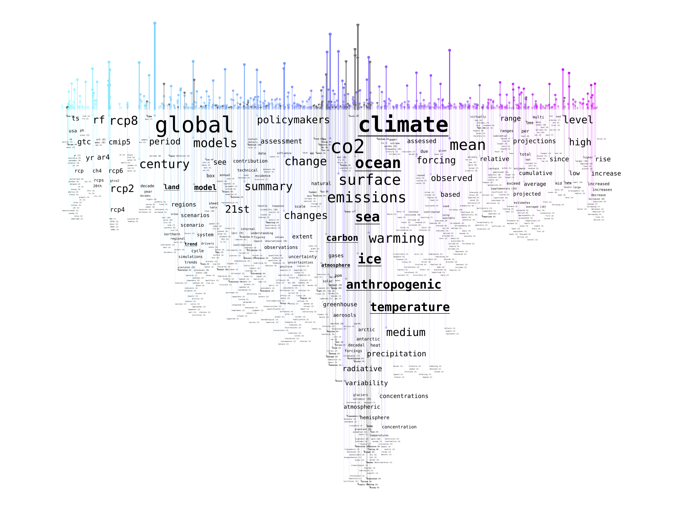

# Word Rain
Code for generating word rains 


<em>Example of word rains for IPCC reports.</em>

## Running 
See `visualise_climate_texts.py` for an example of how the code in `wordrain/generate_wordrain.py` is to be used.

You need a word2vec space, a stop word list and a corpus containing several sub-corpora. The folder CORPUS_FOLDER should contain sub-folders, which each of them contain the sub-corpora to be visualised. The sub-folders, in turn, contain (one or several) .txt-files, where the corpus is stored. The folder "swedish-climate-texts", gives an example of this structure. The Swedish word2vec space used in the example (model-sv.bin )can be found here: http://vectors.nlpl.eu/repository/

```
WORD_SPACE_PATH = "./model-sv.bin"
STOP_WORDS_LIST = "swedish_stopwords_climate.txt"
CORPUS_FOLDER = "swedish-climate-texts"
OUTPUT_FOLDER = "images_climate"
```

## Contributors and funding
Word Rain is a collaboration between the [Centre for Digital Humanities and Social Sciences, Uppsala (CDHU)](https://www.abm.uu.se/cdhu-eng/), the [National Language Bank of Sweden/CLARIN Knowledge Centre for the Languages of Sweden](https://www.isof.se/other-languages/english/clarin-knowledge-centre-for-the-languages-of-sweden-swelang) at the Language Council of Sweden and the [iVis group](https://ivis.itn.liu.se) at Linköping University. The Word Rain is developed as an infrastructure component to support text exploration and comparison, and it is funded by three research infrastructures. Part of the development and practical evaluation of the Word Rain visualisation has also been conducted within the ActDisease project at the [Centre for Medical Humanities]( https://www.uu.se/en/centre/medical-humanities.html).

Research and development of the Word Rain visualisation is thereby been funded by:
- [Huminfra](https://www.huminfra.se): National infrastructure for Research in the Humanities and Social Sciences (Swedish Research Council, 2021-00176)
- [Nationella Språkbanken](https://www.sprakbanken.se): The National Language Bank of Sweden (Swedish Research Council, 2017-00626)
- [InfraVis](https://infravis.se): the Swedish National Research Infrastructure for Data Visualization (Swedish Research Council, 2021-00181)
- [ActDisease](https://www.actdisease.org): Acting out Disease: How Patient Organizations Shaped Modern Medicine: ERC Starting Grant (ERC-2021-STG 101040999)

## Peer-reviewed publications
- Ahltorp A., Hessel J., Eriksson G., Skeppstedt M. (2024) Visualisering av ett lexikons täckning av olika textgenrer: Experiment med en jiddischordbok Accepted for publication in: Nordiske Studier i Leksikografi (In Swedish)
- Skeppstedt M., Aangenendt G. (2024) [Using the Word Rain Technique to Visualize Longitudinal Changes in Periodicals from the Swedish Diabetes Association]( https://diglib.eg.org/items/ce672e07-4c92-4874-9c94-fda406b2e339). Proceedings of Vis4NLP’24 – Visualization for Natural Language Processing (EuroVis 2024)
- Skeppstedt M., Ahltorp M., Kucher K., Lindström M. (2024) [From Word Clouds to Word Rain: Revisiting the Classic Word Cloud to Visualize Climate Change Texts](https://journals.sagepub.com/doi/10.1177/14738716241236188). 

## Conference abstracts
- Skeppstedt, M. & Ahltorp, M (2023) [The Words of Climate Change: TF-IDF-based word clouds derived from climate change reports](https://www.youtube.com/watch?v=nB7E74mQuvI&list=PLtf-Q_ioF5okILlWILULllKVhaBYW4xug&index=1). Poster at Digital Humanities in the Nordic and Baltic Countries
- Rosenbaum, P  & Skeppstedt, M (2023) [Text Mining on Applications for Cultural Funding](https://www.clarin.eu/content/clarin-bazaar-2023). CLARIN Bazaar poster. CLARIN Annual Conference, Leuven
- Skeppstedt, M., Aangenendt, G., & Söderfeldt, Y. (2024) [Visualizing longitudinal trends in digitized periodicals from the Swedish Diabetes Association](http://www.diva-portal.org/smash/record.jsf?pid=diva2%3A1833417&dswid=936). Presentation at the Huminfra Conference

## Presentations and blog posts  
- Utbildningsradion (2024) from [Språkrådsdagen](https://urplay.se/program/237963-sprakradsdagen-2024-ordregn-visualisering-av-klimatprat) (In Swedish)
- [Ordregn – en utveckling av det klassiska ordmolnet] (https://sprakbanken.se/aktuellt/nyheter/2024-05-30-ordregn---en-utveckling-av-det-klassiska-ordmolnet) (In Swedish)

## Installations

See [requirements.txt](requirements.txt)

For a conda environment, the following is needed

conda install numpy

conda install scipy

conda install scikit-learn

conda install gensim

conda install nltk

conda install matplotlib

conda install -c conda-forge python-bidi

conda install anaconda::reportlab

## How to cite

If you use the Word Rain code in an academic setting, please cite this publication:
```
@article{doi:10.1177/14738716241236188,
author = {Maria Skeppstedt and Magnus Ahltorp and Kostiantyn Kucher and Matts Lindström},
title ={From word clouds to Word Rain: Revisiting the classic word cloud to visualize climate change texts},
journal = {Information Visualization},
volume = {23},
number = {3},
pages = {217-238},
year = {2024},
doi = {10.1177/14738716241236188}}
```
